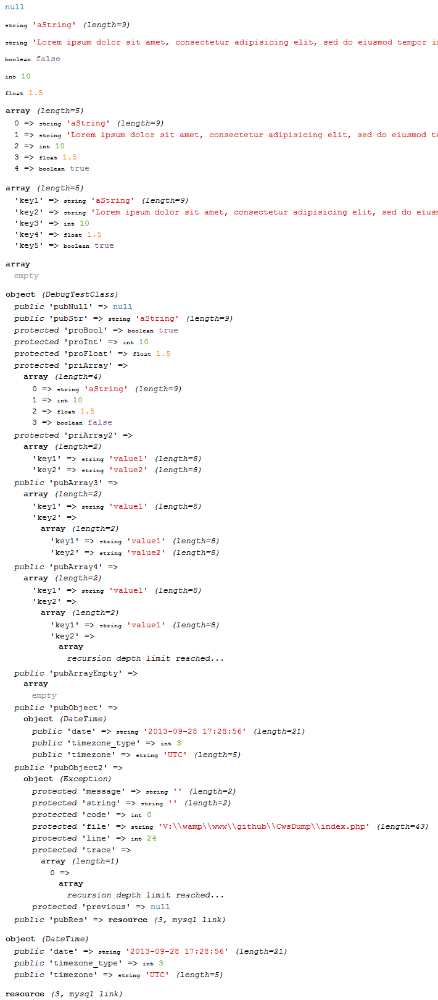

[](https://packagist.org/packages/crazy-max/cws-dump)
[](https://php.net/)
[](https://travis-ci.com/crazy-max/CwsDump)
[](https://www.codacy.com/app/crazy-max/CwsDump)
[](https://www.paypal.com/cgi-bin/webscr?cmd=_s-xclick&hosted_button_id=GCKCDZFTKMPKW)

## About

PHP class to replace var_dump(), print_r() based on the Xdebug style.

## Installation

```bash
composer require crazy-max/cws-dump
```

And download the code:

```bash
composer install # or update
```

## Getting started

Just call `cwsDump()`.<br />
See `tests/test.php` file sample to help you.

## Example



## How can I help ?

All kinds of contributions are welcome :raised_hands:!<br />
The most basic way to show your support is to star :star2: the project, or to raise issues :speech_balloon:<br />
But we're not gonna lie to each other, I'd rather you buy me a beer or two :beers:!

[](https://www.paypal.com/cgi-bin/webscr?cmd=_s-xclick&hosted_button_id=GCKCDZFTKMPKW)

## License

MIT. See `LICENSE` for more details.
